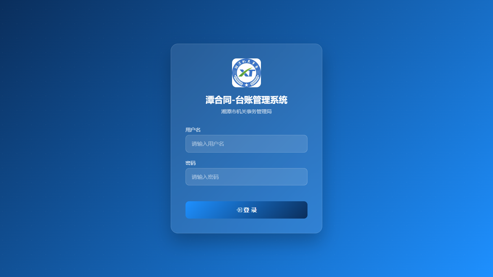
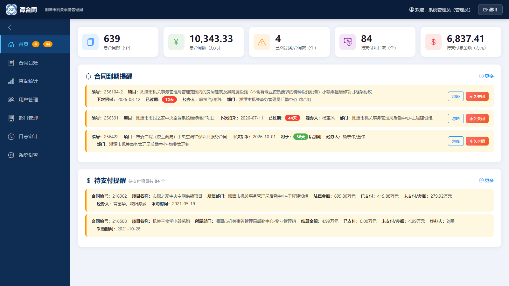
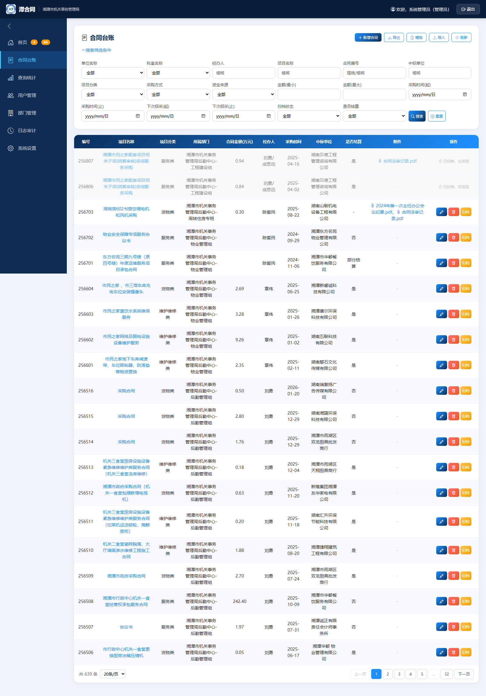
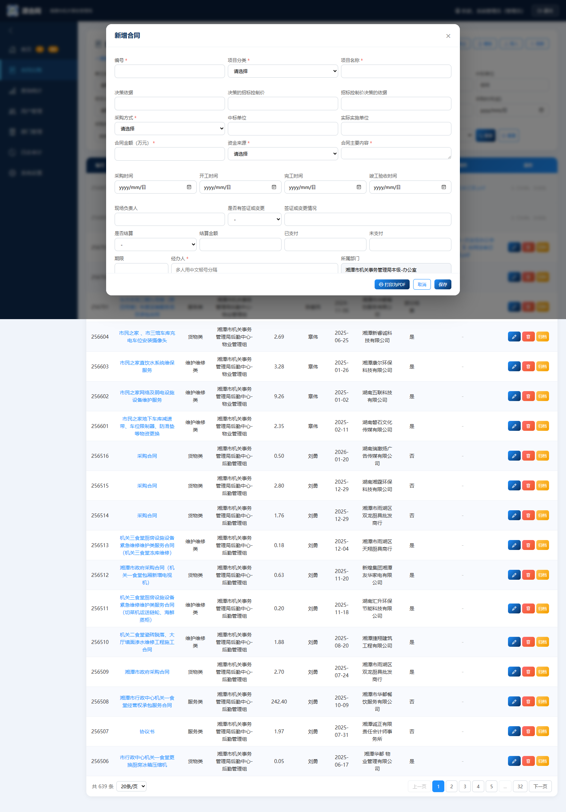
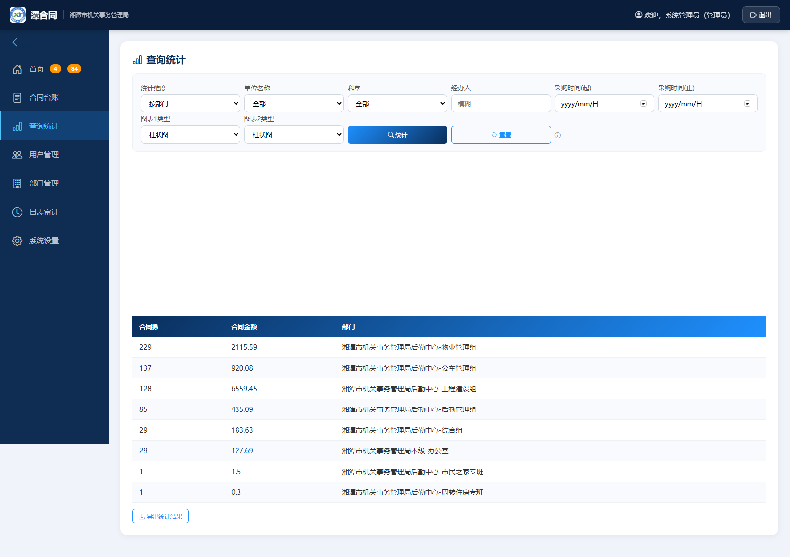
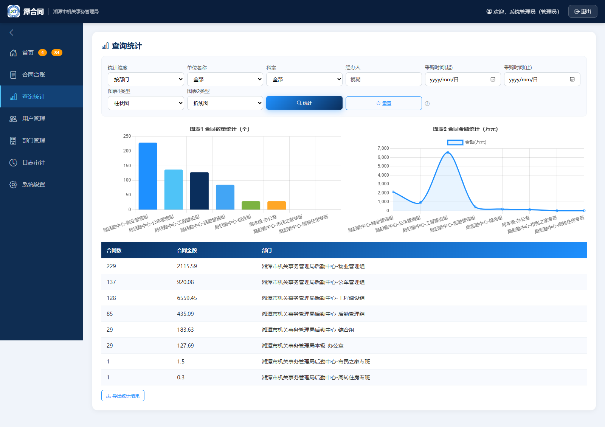
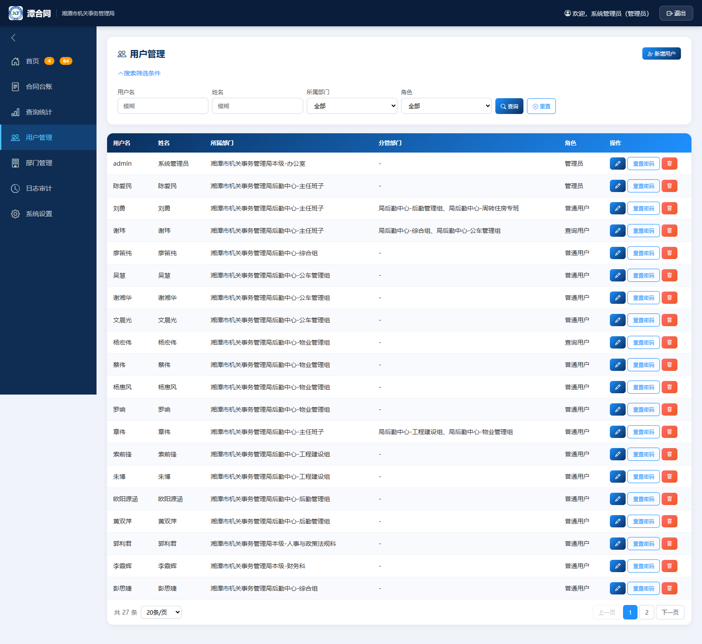
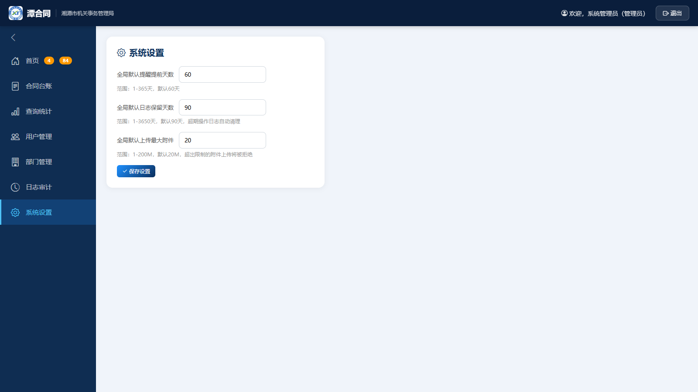

# “潭合同”台账管理系统 —— 用户操作手册

> 适用系统：**“潭合同”台账管理系统**
> 使用单位：**湘潭市机关事务管理局**
> 版本：V1.2（2026年8月）
> 修订说明：V1.1 校正提醒规则、数据范围、备份规则等说明；新增“日志审计”菜单、删除原因填写、日志保留天数与附件大小限制设置等说明；新增首页“待支付项目数”“待支付总金额”卡片与“待支付提醒”区域（含更多/折叠）、合同“打印为PDF”功能、合同台账“资金来源”字段（录入/查询/导出/模板/打印同步支持）等说明。 V1.2 数据库完整性规范化治理（枚举标准化、部门修复、日期规范化）；导入模板必填校验与友好提示；系统升级自动执行数据库版本迁移（无需人工干预）等说明。

---

## 目录

- 一、登录系统
- 二、主界面布局介绍
- 三、首页、合同到期提醒与待支付提醒
- 四、合同台账管理
- 五、查询统计
- 六、用户管理（仅管理员）
- 七、系统设置（仅管理员）
- 八、退出系统
- 附录A：到期提醒与颜色说明
- 附录B：数据备份与恢复规则
- 附录C：常见问题（FAQ）

---

## 一、登录系统

系统部署后，通过浏览器（推荐 Chrome、Edge）访问：

```
http://localhost:5000
```

打开后显示系统登录界面，界面为蓝色科技风全屏渐变背景，中央为半透明登录卡片，从上到下依次为：LOGO 图片、系统名称“潭合同-台账管理系统”、使用单位“湘潭市机关事务管理局”、用户名与密码输入框、登录按钮。



**操作步骤：**

1. 打开浏览器，输入系统地址 `http://localhost:5000`，回车进入登录页。
2. 在“用户名”输入框中输入您的登录账号（工号或拼音，如 `admin`）。
3. 在“密码”输入框中输入您的密码（如初始密码 `123456`）。
4. 点击蓝色“登 录”按钮。
5. 登录成功后自动进入系统主界面；如账号或密码错误，页面会提示错误信息，请重新输入。

> 提示：初始管理员账号为 `admin`，密码为 `123456`。请首次登录后联系管理员修改或由管理员重置密码。

---

## 二、主界面布局介绍

登录成功后进入系统主界面，整体分为三个区域：



**1. 顶部导航栏（深蓝色）**
- 左侧：单位 LOGO、系统名称“潭合同”、使用单位“湘潭市机关事务管理局”。
- 右侧：显示“欢迎，XXX（角色）”，以及“退出”按钮。

**2. 左侧菜单栏（深蓝灰色，宽 220px）**
- **首页**：统计概览与到期提醒列表（首页菜单旁的数字角标为当前待处理提醒数量）。
- **合同台账**：合同的查询、新增、编辑、删除、归档、导出、导入等日常维护操作。
- **查询统计**：按部门、经办人、项目分类、时间等维度进行统计分析与图表展示。
- **用户管理**：仅管理员可见，维护用户与部门信息。
- **部门管理**：仅管理员可见（也可在“用户管理”页内打开），维护部门组合。
- **日志审计**：操作日志的查询、筛选与导出（管理员可查看全部日志，普通用户仅查看本人日志）。
- **系统设置**：仅管理员可见，设置全局默认提醒天数与日志保留天数。

**3. 主内容区（浅灰蓝色背景）**
- 显示当前菜单对应的功能页面，白色卡片、圆角阴影，整体风格统一为蓝色科技风。

点击左侧菜单项即可切换页面，当前所在页面会在菜单中高亮显示。

---

## 三、首页、合同到期提醒与待支付提醒

首页顶部展示五张统计卡片，下方依次为“合同到期提醒”与“待支付提醒”两个列表区域。


### 3.1 五张统计卡片

| 卡片名称 | 含义 |
|----------|------|
| 总合同数 | 当前用户可见范围内的合同记录总数。 |
| 总合同额（万元） | 当前用户可见范围内合同金额的合计（单位：万元）。 |
| 已/将到期合同数 | 按提醒规则筛选出的即将到期或已到期的合同数量。 |
| 待支付项目数（个） | 当前用户可见范围内“未归档且未支付金额大于 0”的合同数量。 |
| 待支付总金额（万元） | 当前用户可见范围内合同待支付金额的合计（单位：万元）。 |

> 说明：
> - 管理员可见全部合同；普通用户与查询用户仅统计本部门及分管部门范围内的合同数据。
> - **待支付金额取值**：优先取合同台账“未支付”字段（包括 0）；若该字段为空，则按“合同金额 − 已支付”计算（合同金额、已支付为空时按 0 处理）。
> - **待支付项目判定**：合同未归档（归档状态为“否”或空）且待支付金额大于 0。

### 3.2 合同到期提醒列表

当存在符合条件的到期提醒合同时，首页“合同到期提醒”区域会显示提醒列表，主要字段包括：合同编号、项目名称、下次招采时间、剩余天数、经办人、所属部门。

- **“忽略”按钮**：点击后该条提醒在当前登录期间不再显示（仅本次登录有效，下次登录仍会提示）。
- **“永久关闭”按钮**：点击后弹出二次确认框，确认后将清空该合同的“下次招采时间”，该合同不再产生提醒。
- **已归档合同**：提醒条目标记“已归档”，仅可“忽略”，不可“永久关闭”（归档合同为只读）。
- **更多/折叠**：提醒条数超过 3 条时，默认仅显示前 3 条，区域标题右侧显示“更多”链接；点击“更多”展开全部提醒，链接变为“折叠”；点击“折叠”恢复仅显示前 3 条。提醒条数不超过 3 条时全部显示且不显示该链接（风格与“待支付提醒”一致）。

若当前没有符合条件的到期合同，页面显示“暂无到期合同”的空状态提示。

### 3.3 提醒规则（重要）

同时满足以下条件的合同才会进入提醒列表：

1. “下次招采时间”不为空；
2. 当前日期 ≥（下次招采时间 − 提醒提前天数）；
3. 合同属于当前用户可见范围（本部门 + 分管部门）。

> 说明：所有合同（含已归档合同）只要满足上述条件均参与到期提醒。如需停止某条合同提醒，可在提醒列表点击“永久关闭”，清空其“下次招采时间”。

其中“提醒提前天数”优先取合同自身的“提醒提前天数”字段；若为空，则使用系统设置中的全局默认值（默认 60 天）。

### 3.4 待支付提醒

“待支付提醒”区域位于“合同到期提醒”下方，标题带美元图标，并动态显示统计说明“待支付项目共 X 个”（X 为当前可见范围内符合条件的合同数量，与首页“待支付项目数（个）”卡片口径一致）。

- **判定条件**：与首页“待支付项目数（个）”卡片口径一致，同时满足以下条件的合同才会进入待支付提醒列表：
  1. 合同未归档（归档状态为“否”或空）；
  2. 待支付金额大于 0。
- **待支付金额取值**：优先取合同台账“未支付”字段（包括 0）；若该字段为空，则按“合同金额 − 已支付”计算（合同金额、已支付为空时按 0 处理）。
- **展示字段**：合同编号、项目名称、所属部门、结算金额、已支付、未支付/差额、经办人、采购时间（金额单位为万元）。
- **更多 / 折叠**：符合条件记录大于 2 条时，默认仅显示前 2 条，并在标题右侧显示“更多”链接；点击“更多”展开全部记录，链接文字变为“折叠”；点击“折叠”恢复为仅显示前 2 条。记录不超过 2 条时全部显示。
- **数据范围**：管理员查看全部合同；普通用户与查询用户仅查看本部门及分管部门范围内的合同。
- **空状态**：无符合条件记录时显示“恭喜，暂无待支付合同”。

---

## 四、合同台账管理

点击左侧菜单“合同台账”，进入合同列表页面，可进行查询、新增、编辑、删除、归档、导出、导入等操作。



### 4.1 顶部工具栏

- **新增合同**：弹出新增合同表单。
- **导出**：将当前查询结果导出为 Excel 文件（.xlsx）。
- **模板 / 导入**：管理员可下载标准导入模板，并按“导入预览 → 确认导入”的流程批量导入数据。
  - 导入模板共 **29 列**，其中 **9 个必填列**：编号、项目分类、项目名称、采购方式、合同金额（万元）、资金来源、合同主要内容、经办人、所属部门（模板“填写说明”第 2 条已注明）。
  - 导入前建议先使用“导入预览”，系统会逐行校验：必填非空、编号唯一、枚举值在标准选项内、日期格式 `yyyy-mm-dd`、金额为数字、所属部门存在于部门列表；错误行（必填为空、编号重复、枚举/日期/金额不合规）会被标记且**不会导入**。
  - 若提交后数据库仍拒绝写入，系统会给出中文原因提示（如必填为空、编号重复、金额非负、日期格式错误等），请按提示检查对应行后重新导入。
- **刷新**：重新加载最新数据。

### 4.2 查询与筛选

点击“搜索”区域可展开/折叠筛选条件，支持以下组合条件：

- 单位名称（下拉）、科室名称（下拉）
- 经办人、项目名称、合同编号、中标单位（模糊查询）
- 项目分类（服务类/维护维修类/货物类/建设项目）
- 采购方式（公开招标/竞争性磋商/竞争性谈判/自行采购）
- 资金来源（年初部门预算/年中追加预算/统筹预算/上级专项转移支付/上年结转结余/其他）
- 合同金额区间、采购时间范围、下次招采时间范围
- 是否结算（是/否）、归档状态（已归档/未归档）

设置条件后点击“搜索”按钮执行查询，点击“重置”清空条件。

### 4.3 表格与分页

- 表格列：编号、项目名称、项目分类、所属部门、合同金额（万元）、经办人、采购时间、中标单位、是否结算、附件、操作（编辑/删除/归档）。
- 表头深蓝色、斑马纹、鼠标悬停行高亮。
- 列表默认按**合同编号降序**排列（数字编号从大到小；非数字编号排在最后），搜索筛选后仍保持该顺序。
- 每页可切换 **20 条 / 50 条**，底部显示总条数与页码，可翻页查看。

### 4.4 新增合同

点击“新增合同”按钮弹出表单（与编辑共用一个模态框），包含合同台账全部 29 个字段。 9 个必填字段（含资金来源）为红色星号标注，未填无法保存；资金来源固定为 6 个下拉选项。



**填写要点：**

1. 带红色星号的为必填项：编号、项目分类、项目名称、采购方式、合同金额（万元）、资金来源、合同主要内容、经办人。
2. **所属部门**：系统根据当前登录用户自动填充，且**不可手动修改**。
3. **提醒提前天数**：默认为全局配置值（如 60），可按需修改；留空时系统自动按全局默认值处理。
4. 日期字段通过日期选择器录入，格式为 `yyyy-mm-dd`；金额字段填写数字，保留两位小数。
5. 点击“保存”提交，成功后自动刷新列表；如编号重复或必填项缺失，系统会提示错误。
6. **资金来源**：必填下拉，取值固定为“年初部门预算、年中追加预算、统筹预算、上级专项转移支付、上年结转结余、其他”六项。

### 4.5 编辑合同

1. 在合同列表中找到目标合同，点击该行“操作”列的“编辑”按钮。
2. 在弹出表单中修改所需字段（“所属部门”仍为只读）。
3. 点击“保存”完成修改。

> 权限说明：普通用户仅能编辑本部门或分管部门合同；查询用户无修改权限；已归档合同仅可浏览，不可编辑。

### 4.6 删除合同

1. 点击目标合同“操作”列的“删除”按钮。
2. 系统弹出二次确认对话框，**需填写删除原因**后点击“确认删除”。
3. 删除后该条记录被物理删除，不可恢复，请谨慎操作；删除原因会记录到“日志审计”。

### 4.7 合同归档

- 点击目标合同“操作”列的“归档”按钮（管理员或该合同经办人可操作）。
- 归档后该合同进入**只读状态**，所有用户仅可浏览，不可编辑、删除或上传附件。

### 4.8 附件管理

- 在新增/编辑合同弹窗中可按“决策依据附件、合同附件、验收结算附件”三类上传附件；
- 支持格式：图片（jpg/jpeg/png/gif/webp/bmp）与 PDF（格式白名单校验）；
- 单文件大小不超过“全局默认上传最大附件”设置值（默认 20M），超限文件将被拒绝；该值可在“系统设置”中调整；
- 附件文件与数据库一同纳入备份与恢复范围（见附录B）；
- 已上传附件可在合同列表中直接点击下载，也可在编辑弹窗中删除。

> 提示：所有写操作（新增/编辑/删除/归档/导入）执行前系统都会自动备份数据文件，备份保留 30 天（详见附录B）。

### 4.9 打印为PDF

在合同列表点击“项目名称”进入合同浏览弹窗，右下角提供“打印为PDF”按钮（位于“关闭/取消”按钮之前）。

- 点击后系统**打开一个新标签页**，仅展示该合同的打印视图（不含系统导航栏、侧边菜单等无关元素），并自动弹出浏览器打印预览，可选择“另存为 PDF”保存。
- 打印内容与页面当前显示的合同数据完全一致，无需二次加载；包含合同全部字段（合同编号、项目分类、项目名称、决策依据、招标控制价、采购方式、中标单位、实际实施单位、合同金额、资金来源、结算金额、已支付、未支付、合同主要内容、采购/开工/完工/竣工验收时间、现场负责人、签证或变更情况、是否结算、期限、经办人、所属部门、下次招采时间、提醒提前天数、备注等）。
- 排版为 **A4 单页**：单条合同内容控制在 1 页内，字体、边距、行距已做紧凑优化，格式整洁。
- 打印视图背景带水印：`打印人：{当前登录用户姓名}　打印时间：YYYY-MM-DD HH:mm:ss`（示例：2026-08-21 14:30:00）；水印为小号浅灰、约 45° 倾斜，覆盖整页但不影响正文阅读，在打印预览与最终 PDF 中均可见。
- 建议使用 Chrome / Edge 浏览器打印，纸张选择 A4，边距使用默认值即可。

---

## 五、查询统计

点击左侧菜单“查询统计”，进入统计分析页面，可按多种维度对合同数据进行统计并以图表展示。



### 5.1 操作步骤

1. 选择**统计维度**：
   - 按部门（单位+科室）
   - 按时间（年/季度）
   - 按经办人
   - 按项目分类
   - 按资金来源
   - 按部门支付情况
   - 按项目支付情况
   - 按部门预算执行情况
   - 按项目预算执行情况
2. 选择**图表类型**：柱状图 / 饼图 / 折线图 / 环形图。
3. 可按需设置查询条件（单位、科室、经办人、采购时间起止、年份等），统计结果与条件联动。
4. 点击“统计”按钮生成统计结果。
5. 点击“重置”按钮可清空筛选条件（统计维度恢复为“按部门”，单位、科室、经办人、采购时间起止、年份恢复为默认）并自动重新统计。



### 5.2 图表说明

- 按部门/项目分类/资金来源/经办人/时间统计时：**图表1** 展示“合同数量统计”，**图表2** 展示“合同金额统计（万元）”。
- 按部门/项目支付情况：**图表1** 对比“未支付金额与已支付金额”，**图表2** 对比“合同金额与未支付金额”（万元）。
- 按部门/项目预算执行情况：**图表1** 对比“招标控制价与合同金额”（万元），**图表2** 展示“偏差率（%）”。
- 两张图表可分别独立切换图表类型，便于对比分析。
- 下方统计明细表格展示具体数据，可点击“导出统计结果”导出为 Excel。

### 5.3 指标口径

- **未支付金额**：优先取合同台账“未支付”字段；该字段为空时，按“合同金额 - 已支付”自动计算。
- **预算执行对比**：招标控制价与合同金额均按所选分组汇总求和；差额 = 合同金额合计 - 招标控制价合计；偏差率 = 差额 ÷ 招标控制价合计 × 100%（招标控制价合计为 0 时不计算偏差率）。
- 统计范围与查询条件（单位、科室、经办人、采购时间起止、年份）联动，口径与合同列表一致。

> 说明：按部门统计时，图例中的部门名称会统一使用简称，例如“湘潭市机关事务管理局后勤中心-物业管理组”显示为“局后勤中心-物业管理组”。
> 数据范围：管理员统计全部合同；普通用户与查询用户仅统计本部门及分管部门范围内的合同。

---

## 六、用户管理（仅管理员）

点击左侧菜单“用户管理”，进入用户管理页面，可维护部门信息和系统用户。



### 6.1 部门维护

1. 点击页面顶部的“部门维护”按钮，弹出部门管理对话框。
2. 对话框中列出已有部门（单位名称 + 科室名称组合）。
3. **新增部门**：输入单位名称与科室名称，点击新增。
4. **删除部门**：点击对应部门的删除按钮；若该部门下存在关联用户，系统会提示无法删除。

> 说明：部门组合“单位名称-科室名称”全局唯一，用户和合同的“所属部门”均取自该列表。

### 6.2 用户列表

用户列表展示：用户名、姓名、所属部门、角色、操作。

| 角色 | 说明 |
|------|------|
| 管理员 | 可维护用户、部门、系统设置，可操作所有合同，查看所有统计与提醒。 |
| 普通用户 | 可新增合同；编辑、删除本部门及分管部门合同；接收本部门+分管部门合同的到期提醒与待支付提醒。 |
| 查询用户 | 仅可查询、统计、导出合同，查看提醒列表（含待支付提醒），无修改权限。 |

### 6.3 新增 / 编辑用户

1. 点击“新增用户”按钮（或用户列表中的“编辑”）。
2. 填写用户名、姓名，选择所属部门（从已有部门组合中选择）与角色。
3. 如所属部门为领导岗位（局领导、主任班子、中心班子），可勾选“分管部门”授予管理范围。
4. 保存后生效；新用户默认密码为 `123456`。

### 6.4 重置密码

- 点击用户列表中的“重置密码”按钮，该用户密码将被重置为 **`123456`**。
- 重置后请及时通知用户修改或使用新密码登录。

### 6.5 删除用户

- 点击用户列表中的“删除”按钮并二次确认后删除该用户；默认管理员 `admin` 不可删除。

---

## 七、系统设置（仅管理员）

点击左侧菜单“系统设置”，进入系统设置页面。



### 7.1 全局默认提醒提前天数

1. 在“默认提醒天数”数字输入框中输入新的天数（系统允许范围为 1～365，默认值为 60）。
2. 点击“保存”按钮。
3. 保存成功后提示“保存成功”，设置**即时生效**（无需重启系统）。

> 说明：该值为合同“提醒提前天数”为空时的兜底取值。修改后，后续所有提醒计算均按新值执行；各合同若单独设置了提醒天数，则优先使用合同自身设置。

### 7.2 日志保留天数

1. 在“日志保留天数”输入框中输入新的天数（默认 90 天）。
2. 点击“保存”按钮。
3. 超过保留天数的历史操作日志将在系统运行中自动清理。

### 7.3 全局默认上传最大附件

1. 在“全局默认上传最大附件”输入框中输入新的上限（允许范围 1～200，默认 20）。
2. 点击“保存”按钮。
3. 保存后即时生效；后续附件上传超过该上限将被拒绝（含合同新增/编辑中的附件上传）。

---

## 八、退出系统

1. 点击主界面右上角的“退出”按钮。
2. 系统清除当前登录会话，自动返回登录界面。
3. 为保障数据安全，使用公用电脑时请务必在离开前退出系统。

---

## 附录A：到期提醒与颜色说明

在合同台账列表和首页提醒中，根据“剩余天数”显示不同颜色：

| 剩余天数 | 显示颜色 | 含义 |
|----------|----------|------|
| 剩余天数 > 提醒天数 | 正常（黑色/默认） | 尚未进入提醒窗口，正常显示。 |
| 0 ≤ 剩余天数 ≤ 提醒天数 | 橙色 | 已进入提醒窗口，需要关注（即将到期）。 |
| 剩余天数 < 0 | 红色 | 已超过“下次招采时间”，务必尽快处理。 |

> 其中“提醒天数”取合同自身的“提醒提前天数”，为空时使用全局默认值（默认 60 天）。

---

## 附录B：数据备份与恢复规则

- 系统在每次写操作（新增、编辑、删除、归档、导入等）前，自动对数据库进行备份：
  - 备份目录：项目下 `backups/` 文件夹；
  - 备份文件名格式：`合同台账_YYYYMMDD_HHMMSS.db`（精确到秒）；
  - 保留策略：备份文件保留 **30 天**，超期自动清理。
- **恢复方法**：如需恢复数据，请联系系统管理员；管理员可在停止服务后将所需备份文件复制替换至 `data/合同台账.db`，同时恢复 `data/attachments/` 附件目录。
- 普通用户无需自行备份；如发生数据异常，请及时联系管理员处理。

---

## 附录C：常见问题（FAQ）

**Q1：登录时提示“用户名或密码错误”？**
答：请确认账号与密码输入无误；若忘记密码，请联系管理员在“用户管理”中重置密码为 `123456`。

**Q2：为什么我看不到“用户管理”“系统设置”菜单？**
答：这两个菜单仅对角色为“管理员”的用户可见，请使用管理员账号登录。

**Q3：为什么我只能编辑部分合同？**
答：普通用户只能编辑、删除“所属部门”为本部门或分管部门的合同；如需调整部门归属，请联系管理员。

**Q4：某条合同一直出现在到期提醒里？**
答：该合同满足提醒规则（下次招采时间非空、已进入提醒窗口，且属于您的可见范围；含已归档合同）。如需不再提醒，可在提醒列表中点击“永久关闭”（需二次确认），将清空该合同的下次招采时间；已归档合同仅可“忽略”。

**Q5：修改“系统设置”中的默认提醒天数后，已有合同会变吗？**
答：新值立即生效。已单独设置“提醒提前天数”的合同仍按自身设置计算，仅未单独设置的合同使用新的全局默认值。

**Q6：导出的 Excel 文件包含哪些列？**
答：导出的 Excel 包含全部 29 列台账字段，日期字段统一为 `yyyy-mm-dd` 格式。

**Q7：系统备份到哪里？**
答：只有发生写操作（新增/编辑/删除/归档/导入）时才会自动备份，备份文件保存在项目 `backups/` 目录（数据库文件 `.db`，保留 30 天）；纯查询不产生备份。

**Q8：删除合同为什么要填写原因？**
答：删除为不可恢复操作，填写原因用于审计留痕，原因会记录在“日志审计”中，满足机关经办与审批分离的管理要求。

**Q9：附件支持哪些格式？大小有限制吗？**
答：支持图片（jpg/jpeg/png/gif/webp/bmp）与 PDF 格式，上传时系统校验格式白名单；单文件大小默认不超过 20M（可在“系统设置”中调整“全局默认上传最大附件”），超限将被拒绝。

**Q10：为什么我看不到其他部门的合同提醒？**
答：普通用户与查询用户仅接收本部门及分管部门范围内合同的到期提醒；管理员可查看全部提醒。

**Q11：为什么某条合同没有出现在“待支付提醒”里？**
答：待支付提醒与首页“待支付项目数（个）”卡片口径一致，要求合同同时满足：未归档（归档状态为“否”或空）、待支付金额大于 0（待支付金额优先取台账“未支付”字段，为空时按“合同金额 − 已支付”计算），且属于您的可见数据范围。

**Q12：点击“打印为PDF”没有弹出新标签页？**
答：请检查浏览器是否拦截了弹窗（地址栏附近会有拦截提示），允许该站点弹窗后重试；若仍被拦截，系统会自动改用当前页内的隐藏方式触发打印预览。

**Q13：导入时提示“数据库约束拒绝写入”是什么意思？**
答：说明该行存在必填字段为空、编号重复、金额为负或日期格式错误等问题，请按提示检查对应行后重新导入；系统不会静默修改您的数据。

---

*本手册随系统版本更新，如有疑问请联系系统管理员。*
